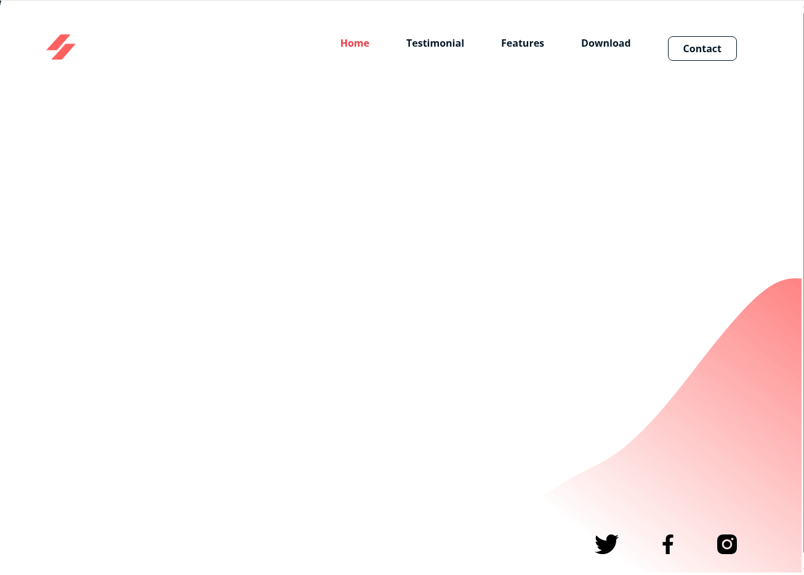

# 🌐 Responsive Website Project

This is a simple, clean, and responsive website built with **HTML**, **CSS**, and a bit of **JavaScript**. It features a fully functional mobile navigation menu with a smooth circular splash animation triggered from the hamburger icon. ✨

## 📱 Features

- Fully responsive layout
- Animated hamburger menu
- Circular splash reveal effect for mobile nav
- Smooth transition

## 📸 Screenshots

| Desktop View                                      | Mobile View                                     |
| ------------------------------------------------- | ----------------------------------------------- |
|  |  |

## 🚀 Live Demo

Check out the live version here:  
🔗 **[https://kenvastolord.github.io/Responsive_website/](https://kenvastolord.github.io/Responsive_website/)**

## 🛠 Tech Stack

- HTML5
- CSS3
- JavaScript (Vanilla)
- Git
